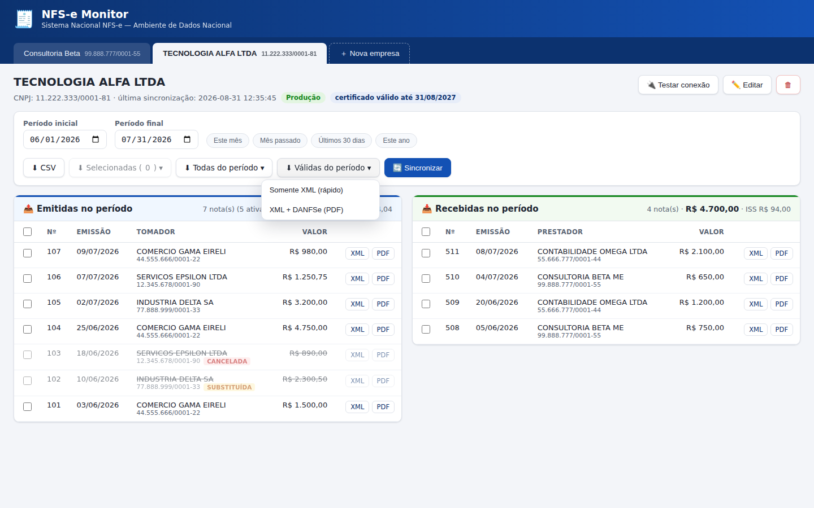

# NFS-e Monitor — Portal Nacional da NFS-e

Aplicação web **local** para consultar e baixar as Notas Fiscais de Serviço
eletrônicas (NFS-e) do **Sistema Nacional NFS-e** (Portal Nacional —
[gov.br/nfse](https://www.gov.br/nfse)), em **ambiente de produção**.

Cada empresa é uma **aba** com seu próprio certificado digital A1. Para o
período escolhido (data inicial → data final), o painel mostra duas colunas:

- 📤 **Emitidas no período** — notas em que a empresa é a prestadora;
- 📥 **Recebidas no período** — notas em que a empresa é a tomadora.



## Funcionalidades

- **Abas por empresa**, com cadastro via certificado digital **A1 (.pfx/.p12)** —
  CNPJ, razão social e validade são extraídos automaticamente do certificado;
- **Sincronização com o ADN** (Ambiente de Dados Nacional) pela API oficial de
  Distribuição de DF-e aos contribuintes (`GET /contribuintes/DFe/{NSU}`),
  com autenticação mútua **mTLS** e controle incremental por **NSU**;
- **Filtro por período** (data de emissão) com atalhos: este mês, mês passado,
  últimos 30 dias, este ano;
- **Totais por coluna**: quantidade, valor dos serviços e ISS (somando apenas
  notas ativas);
- **Eventos**: cancelamentos e substituições são aplicados automaticamente à
  situação das notas (etiquetas *CANCELADA* / *SUBSTITUÍDA*);
- **Downloads**: XML da NFS-e, **DANFSe (PDF)** via API nacional e exportação
  **CSV** do período (abre no Excel);
- **Download em lote (ZIP)**: marque notas nas caixas de seleção e use
  **⬇ Selecionadas**, baixe **⬇ Todas do período** ou apenas as
  **⬇ Válidas do período** (exclui canceladas e substituídas) — em todos,
  escolha *Somente XML* ou *XML + DANFSe (PDF)*. O ZIP vem organizado nas
  pastas `Emitidas/` e `Recebidas/`;
- Alerta de **vencimento do certificado** (30 dias) e teste de conexão mTLS;
- Tudo fica **no seu computador**: banco SQLite local, senha do certificado
  criptografada (chave local em `data/.chave_secreta`).

## Requisitos

- **Python 3.10 ou superior** — [python.org/downloads](https://www.python.org/downloads/)
  (no Windows, marque *"Add Python to PATH"* na instalação);
- Certificado digital **A1** (arquivo `.pfx` ou `.p12` + senha) de cada empresa,
  emitido por autoridade ICP-Brasil (e-CNPJ);
- Internet liberada para `adn.nfse.gov.br` e `sefin.nfse.gov.br` (porta 443).

## Como executar

### Windows

Dê dois cliques em **`run.bat`** (na primeira execução ele cria o ambiente e
instala as dependências). O navegador abre automaticamente em
`http://127.0.0.1:8765`.

### Linux / macOS

```bash
./run.sh
```

### Manual (qualquer sistema)

```bash
pip install -r requirements.txt
python run.py            # abre o navegador em http://127.0.0.1:8765
python run.py --port 9000 --no-browser   # opções
```

## Como usar

1. **＋ Nova empresa** → selecione o arquivo `.pfx`, informe a senha e o
   ambiente (**Produção** para notas reais). O sistema valida o certificado e
   cria a aba da empresa.
2. Clique em **🔄 Sincronizar**. A primeira sincronização baixa **todo o
   histórico** disponível no ADN para o CNPJ (em lotes de 50 documentos);
   as seguintes baixam apenas o que for novo (controle por NSU).
3. Escolha o **período inicial e final** — as colunas de emitidas e recebidas
   e os totais são recalculados na hora (consulta local, instantânea).
4. Clique numa nota para ver os detalhes (valores, ISS, discriminação, chave
   de acesso, eventos) ou use os botões **XML** / **PDF** / **⬇ CSV**.

> **Frequência de sincronização:** o manual do ADN pede intervalo mínimo de
> **1 hora** entre consultas quando não há documentos novos. Sincronize uma ou
> duas vezes por dia — o filtro por período não precisa de nova sincronização.

## Como funciona (APIs oficiais)

| Operação | Endpoint |
|---|---|
| Distribuição de DF-e por NSU | `GET https://adn.nfse.gov.br/contribuintes/DFe/{ultimoNSU}` |
| Eventos por chave de acesso | `GET https://adn.nfse.gov.br/contribuintes/NFSe/{chave}/Eventos` |
| DANFSe (PDF) | `GET https://sefin.nfse.gov.br/sefinnacional/danfse/{chave}` |

Todas exigem **mTLS** com certificado ICP-Brasil. O ADN distribui os
documentos em que o CNPJ do certificado figura como **emitente, tomador ou
intermediário** — é isso que alimenta as colunas de emitidas/recebidas.
O XML vem em GZip+Base64 no campo `ArquivoXml` e é interpretado pelo leiaute
nacional (namespace `http://www.sped.fazenda.gov.br/nfse`).

Documentação oficial: [APIs Prod. Restrita e Produção](https://www.gov.br/nfse/pt-br/biblioteca/documentacao-tecnica/apis-prod-restrita-e-producao) ·
[Manual do contribuinte — APIs do ADN](https://www.gov.br/nfse/pt-br/biblioteca/documentacao-tecnica/documentacao-atual/manual-contribuintes-apis-adn-sistema-nacional-nfse.pdf)

## Limitações importantes

- **Somente consulta/download** — o sistema não emite NFS-e;
- **Certificado A1** apenas (A3/token não é suportado);
- O ADN só contém notas de **municípios integrados ao padrão nacional** (ou
  que compartilham seus documentos com o ADN). Notas de sistemas municipais
  não conveniados não aparecem;
- A distribuição é sequencial por NSU: **não há filtro de data no servidor** —
  por isso o sistema sincroniza tudo uma vez e filtra localmente;
- O certificado precisa ser do **mesmo CNPJ** (ou mesma raiz de CNPJ) das
  notas consultadas.

## Segurança

- A pasta **`data/`** guarda certificados, senhas criptografadas e o banco de
  notas — ela está no `.gitignore` e **nunca deve ser copiada/enviada**;
- A senha de cada certificado é criptografada (Fernet/AES-128) com a chave
  local `data/.chave_secreta`;
- O servidor escuta apenas em `127.0.0.1` (não é acessível pela rede). Não
  exponha a porta na internet sem adicionar autenticação.

## Testes

```bash
python tests/e2e.py
```

Sobe um **ADN simulado com mTLS real** (certificados de teste gerados na hora)
e valida o fluxo completo: cadastro, sincronização por NSU, filtro por
período, cancelamento por evento, downloads e idempotência.

## Variáveis de ambiente (avançado)

| Variável | Uso |
|---|---|
| `NFSE_DATA_DIR` | Pasta de dados (padrão: `./data`) |
| `NFSE_ADN_BASE` / `NFSE_SEFIN_BASE` | Redireciona as APIs (testes) |
| `NFSE_CA_EXTRA` | PEM de CA adicional para o TLS do servidor nacional |

## Estrutura do projeto

```
app/            backend FastAPI
  main.py       rotas da API local
  adn_client.py cliente mTLS das APIs nacionais (ADN/SEFIN)
  certificado.py leitura do .pfx e extração de CNPJ (ICP-Brasil)
  xml_nfse.py   parser do leiaute nacional (NFS-e e eventos)
  sync.py       sincronização incremental por NSU
  db.py         SQLite local
  security.py   criptografia das senhas
static/         interface web (abas, colunas, filtros)
tests/          ADN simulado + teste de ponta a ponta
run.py|bat|sh   inicialização
```
